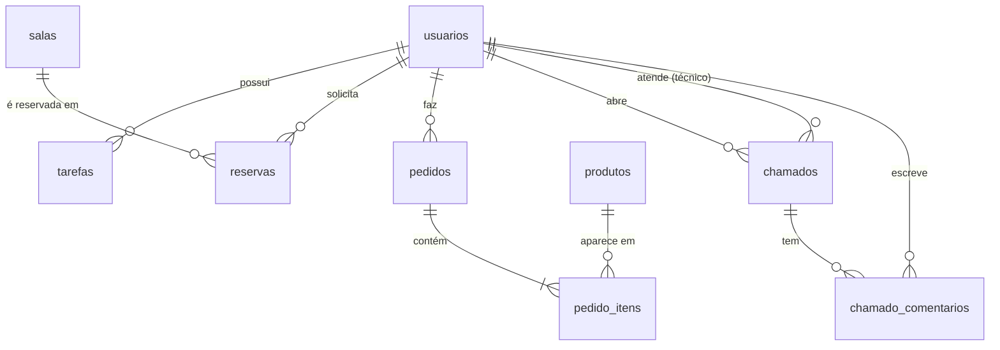

# 🎓 Escola Conectada - Sistema Escolar Integrado

Projeto do curso técnico de **Desenvolvimento de Sistemas**.
Front-end em **HTML + CSS + JavaScript** e back-end em **PHP + MySQL**, com **CRUD**, **autenticação**, **relatórios** e **integração front-end/back-end** (o JavaScript usa `fetch()` para chamar uma API PHP que responde em JSON).

| Módulo | O que faz |
|---|---|
| 📚 **Agenda de tarefas do aluno** | Cada usuário logado cadastra, edita, conclui e exclui as próprias tarefas (disciplina, data de entrega, prioridade e status). Destaca as atrasadas. |
| 🏫 **Reserva de salas e laboratório de informática** | Cadastro de salas e laboratórios (admin), pedidos de reserva com **verificação de conflito de horário**, aprovação ou recusa pelo admin e mapa visual de ocupação do dia. |
| 🍔 **Cantina escolar** | Cardápio com carrinho, pedidos com **baixa automática de estoque** (em transação), fila de pedidos em quadro *kanban* (pendente → preparando → pronto → entregue), cadastro de produtos e relatórios de vendas. |
| 🛠️ **Help desk de TI** | Abertura de chamados, atribuição de técnico, mudança de status, registro da solução, comentários e histórico. O solicitante confirma ou reabre o chamado. |
| 📊 **Relatórios** | Por período, com indicadores, gráficos de barras, tabela detalhada, **impressão/PDF** e **exportação CSV (Excel)**. |
| 🗄️ **Banco de Dados** | Tela (só admin) para ver todas as tabelas: registros, estrutura, chaves estrangeiras, `CREATE TABLE` e um **console SQL somente leitura**. |

---

## 📁 Estrutura de pastas

```
sistema-escolar/
├── index.php              → redireciona para login ou painel
├── login.php              → login + cadastro de aluno
├── logout.php
├── dashboard.php          → painel com indicadores
├── tarefas.php            → agenda de tarefas
├── reservas.php           → reservas + mapa de ocupação
├── salas.php              → cadastro de salas (admin)
├── cantina.php            → cardápio, carrinho e meus pedidos
├── cantina-admin.php      → fila de pedidos, histórico e produtos (admin)
├── chamados.php           → help desk de TI
├── relatorios.php         → relatórios
├── usuarios.php           → cadastro de usuários (admin)
├── banco.php              → visualizador do banco (admin)
├── perfil.php             → alterar nome e senha
│
├── api/                   → BACK-END: endpoints PHP que respondem JSON
│   ├── _bootstrap.php     → carregado por todos (conexão, sessão, CSRF, erros)
│   ├── auth.php           → login, cadastro, logout
│   ├── tarefas.php        ├── salas.php       ├── reservas.php
│   ├── produtos.php       ├── pedidos.php     ├── chamados.php
│   ├── usuarios.php       ├── relatorios.php  ├── dashboard.php
│   └── banco.php
│
├── assets/
│   ├── css/style.css      → visual do sistema (responsivo + estilo de impressão)
│   └── js/                → FRONT-END: um arquivo JS por página + app.js (funções comuns)
│
├── config/
│   ├── config.php         → ⚙️ DADOS DE ACESSO AO MYSQL
│   └── database.php       → conexão PDO
├── includes/
│   ├── auth.php           → sessão, login e controle de acesso por perfil
│   ├── helpers.php        → validações, JSON, CSRF
│   ├── header.php / footer.php → layout com menu lateral
│
├── database/
│   └── escola_db.sql      → 🗄️ SCRIPT DO BANCO (tabelas, views e dados de exemplo)
│
├── Dockerfile / docker-compose.yml → opcional: sobe tudo (PHP + MySQL + phpMyAdmin)
└── README.md
```

---

## 🚀 Como executar

### Opção 1 - XAMPP (recomendado para a escola)

1. Instale o [XAMPP](https://www.apachefriends.org/) e inicie **Apache** e **MySQL** no painel.
2. Copie a pasta `sistema-escolar` para `C:\xampp\htdocs\` (Linux: `/opt/lampp/htdocs/`).
3. Abra **http://localhost/phpmyadmin** → aba **Importar** → escolha `sistema-escolar/database/escola_db.sql` → **Executar**.
   O banco `escola_db` é criado com todas as tabelas e dados de exemplo.
4. Se o seu MySQL tiver senha, ajuste `config/config.php` (`DB_USER` / `DB_PASS`). No XAMPP o padrão é `root` sem senha.
5. Acesse **http://localhost/sistema-escolar**.

> WAMP, Laragon e USBWebserver funcionam do mesmo jeito: copie a pasta para o diretório `www`/`htdocs` e importe o `.sql`.

### Opção 2 - Docker (um comando)

```bash
cd sistema-escolar
docker compose up -d
```

| Serviço | Endereço |
|---|---|
| Sistema | http://localhost:8080 |
| phpMyAdmin | http://localhost:8081 (usuário `root`, senha `root`) |
| MySQL | `localhost:3306` (usuário `root`, senha `root`) |

O banco é importado automaticamente na primeira execução.

### Opção 3 - Servidor embutido do PHP (para testes rápidos)

```bash
mysql -u root -p < database/escola_db.sql
cd sistema-escolar
php -S localhost:8000
```

---

## 👤 Usuários de demonstração

Senha de todos: **`123456`**

| E-mail | Perfil | O que pode fazer |
|---|---|---|
| `admin@escola.com` | Administrador | Tudo: aprova reservas, gerencia salas, cantina, usuários, chamados, todos os relatórios e o banco de dados |
| `professor@escola.com` | Professor | Tarefas, reservas, pedidos, chamados e relatório geral de tarefas dos alunos |
| `aluno@escola.com` | Aluno | Tarefas, reservas (precisam de aprovação), pedidos na cantina e chamados |
| `tecnico@escola.com` | Técnico de TI | Atende todos os chamados e vê o relatório de chamados |

Alunos novos podem se cadastrar na própria tela de login.

---

## 🗄️ Como acessar o banco de dados

O banco se chama **`escola_db`**. Há quatro formas de acessá-lo:

1. **Pelo próprio sistema**: entre como `admin@escola.com` → menu **Banco de Dados**.
   Mostra todas as tabelas e views com a quantidade de registros, os dados, a estrutura (tipos, PK, FK), o `CREATE TABLE` e um console para consultas `SELECT`.
   As senhas aparecem mascaradas e o console não permite alterar dados.
2. **phpMyAdmin**: `http://localhost/phpmyadmin` (XAMPP) ou `http://localhost:8081` (Docker).
3. **Cliente MySQL** (MySQL Workbench, DBeaver, HeidiSQL): host `localhost`, porta `3306`, usuário `root`, senha vazia no XAMPP ou `root` no Docker.
4. **Terminal**: `mysql -u root -p escola_db`

### Modelo de dados



| Tabela | Descrição |
|---|---|
| `usuarios` | Todos os usuários. Campo `perfil`: admin, professor, aluno ou técnico. Senha guardada como hash (bcrypt). |
| `tarefas` | Agenda do aluno. |
| `salas` | Salas, laboratórios e auditório. |
| `reservas` | Reservas de salas (data, horário, status). |
| `produtos` | Produtos da cantina (preço e estoque). |
| `pedidos` / `pedido_itens` | Pedidos e seus itens. O preço é gravado no item para manter o histórico. |
| `chamados` / `chamado_comentarios` | Chamados de TI e o histórico de cada um. |
| `vw_vendas_diarias`, `vw_chamados_detalhados`, `vw_reservas_detalhadas` | **Views** com consultas prontas para relatórios. |

---

## 🔌 Integração front-end ↔ back-end (API)

As páginas `.php` montam o HTML. Os arquivos em `assets/js/` usam `fetch()` para chamar a API em `api/`, que responde em JSON. Cada recurso segue o padrão REST:

| Método HTTP | Exemplo | Ação (CRUD) |
|---|---|---|
| `GET` | `api/tarefas.php` | **R**ead: lista |
| `GET` | `api/tarefas.php?id=3` | **R**ead: um registro |
| `POST` | `api/tarefas.php` | **C**reate: cria |
| `PUT` | `api/tarefas.php?id=3` | **U**pdate: atualiza |
| `PATCH` | `api/tarefas.php?id=3` | **U**pdate parcial (ex.: só o status) |
| `DELETE` | `api/tarefas.php?id=3` | **D**elete: exclui |

Exemplo no JavaScript (`assets/js/tarefas.js`):

```js
await App.api('api/tarefas.php', {
    method: 'POST',
    body: { titulo: 'Trabalho de BD', data_entrega: '2026-10-20', prioridade: 'alta' }
});
```

Exemplo no PHP (`api/tarefas.php`):

```php
$stmt = db()->prepare('INSERT INTO tarefas (titulo, ..., usuario_id) VALUES (?, ..., ?)');
$stmt->execute([...$valores, $uid]);
json_resposta(['mensagem' => 'Tarefa criada!'], 201);
```

---

## 🔒 Segurança aplicada

- **Senhas com hash**: `password_hash()` / `password_verify()` (bcrypt).
- **SQL Injection**: todas as consultas usam *prepared statements* (PDO).
- **XSS**: textos escapados com `htmlspecialchars()` no PHP e `App.esc()` no JS.
- **CSRF**: token por sessão, enviado no cabeçalho `X-CSRF-Token` de toda requisição que altera dados.
- **Sessão**: cookie `HttpOnly` e `SameSite=Lax`, com `session_regenerate_id()` no login.
- **Controle de acesso por perfil**: em cada página (`exigir_perfil`) e em cada endpoint da API (`api_exigir_perfil`). Cada usuário só vê os próprios dados.
- **Transações** no pedido da cantina (`beginTransaction` / `commit` / `rollBack` e `SELECT ... FOR UPDATE`), para não vender além do estoque.
- Pastas `config/`, `includes/` e `database/` protegidas por `.htaccess` contra acesso pelo navegador.

---

## ✅ Regras de negócio implementadas

- **Reservas**: não aceita data passada nem hora final antes da inicial. Recusa reservas que se sobrepõem a outra pendente ou aprovada na mesma sala. As do aluno e do professor ficam *pendentes* até o admin aprovar; as do admin já nascem aprovadas.
- **Cantina**: confere o estoque ao fazer o pedido, dá baixa automática e devolve o estoque se o pedido for cancelado. O cliente só cancela enquanto o pedido está *pendente*. Um produto que já foi vendido não é apagado, só desativado, para preservar o histórico.
- **Chamados**: o técnico precisa escrever a solução para marcar como *resolvido*. Toda mudança de status é registrada no histórico. O solicitante confirma (fecha) ou reabre o chamado. Quem abre só pode editar ou excluir enquanto ninguém começou o atendimento.
- **Tarefas**: as atrasadas (vencidas e não concluídas) aparecem destacadas na lista, no painel e nos relatórios.
